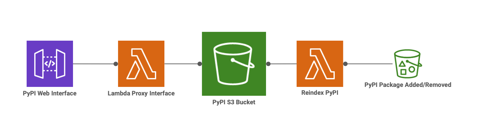

# Serverless PyPI

[](https://registry.terraform.io/modules/amancevice/serverless-pypi/aws)
[](https://github.com/amancevice/terraform-aws-serverless-pypi/actions)
[](https://codeclimate.com/github/amancevice/terraform-aws-serverless-pypi/test_coverage)
[](https://codeclimate.com/github/amancevice/terraform-aws-serverless-pypi/maintainability)

S3-backed serverless PyPI.

Requests to your PyPI server will be proxied through a Lambda function that pulls content from an S3 bucket and responds with the same HTML content that you might find in a conventional PyPI server.

Requests to the base path (eg, `/simple/`) will respond with the contents of an `index.html` file at the root of your S3 bucket.

Requests to the package index (eg, `/simple/fizz/`) will dynamically generate an HTML file based on the contents of keys under that namespace (eg, `s3://your-bucket/fizz/`). URLs for package downloads are presigned S3 URLs with a default lifespan of 15 minutes.

Package uploads/removals on S3 will trigger a Lambda function that reindexes the bucket and generates a new `index.html` at the root. This is done to save time when querying the base path when your bucket contains a multitude of packages.



## Usage

As of v3 users are expected to bring-your-own HTTP (v2) API instead of providing one inside the module. This gives users greater flexibility in choosing how their API is set up.

The most simplistic setup is as follows:

```terraform
resource "aws_apigatewayv2_api" "pypi" {
  name          = "pypi"
  protocol_type = "HTTP"
}

module "serverless_pypi" {
  source  = "amancevice/serverless-pypi/aws"
  version = "~> 3.0"

  api_id                       = aws_apigatewayv2_api.pypi.id
  api_execution_arn            = aws_apigatewayv2_api.pypi.execution_arn
  iam_role_name                = "serverless-pypi-role"
  lambda_api_function_name     = "serverless-pypi-api"
  lambda_reindex_function_name = "serverless-pypi-reindex"
  s3_bucket_name               = "serverless-pypi"
  sns_topic_name               = "serverless-pypi"

  # etc …
}
```

## S3 Bucket Organization

This tool is highly opinionated about how your S3 bucket is organized. Your root key space should only contain the auto-generated `index.html` and "directories" of your PyPI packages.

Packages should exist one level deep in the bucket where the prefix is the name of the project.

Example:

```
s3://your-bucket/
├── index.html
├── my-cool-package/
│   ├── my-cool-package-0.1.2.tar.gz
│   ├── my-cool-package-1.2.3.tar.gz
│   └── my-cool-package-2.3.4.tar.gz
└── my-other-package/
    ├── my-other-package-0.1.2.tar.gz
    ├── my-other-package-1.2.3.tar.gz
    └── my-other-package-2.3.4.tar.gz
```

## Fallback PyPI Index

You can configure your PyPI index to fall back to a different PyPI in the event that a package is not found in your bucket.

Without configuring a fallback index URL the following `pip install` command will surely fail (assuming you don't have `boto3` and all its dependencies in your S3 bucket):

```bash
pip install boto3 --index-url https://my.private.pypi/simple/
```

Instead, if you configure a fallback index URL in the terraform module, then requests for a pip that isn't found in the bucket will be re-routed to the fallback.

```terraform
module "serverless_pypi" {
  source  = "amancevice/serverless-pypi/aws"
  version = "~> 3.0"

  lambda_api_fallback_index_url = "https://pypi.org/simple/"

  # etc …
}
```

## Auth

Please note that this tool provides **NO** authentication layer for your PyPI index out of the box. This is difficult to implement because `pip` is currently not very forgiving with any kind of auth pattern outside Basic Auth.

### Cognito Basic Auth

I have provided a _very_ simple authentication implementation using AWS Cognito and API Gateway authorizers.

Add a Cognito-backed Basic authentication layer to your serverless PyPI with the `serverless-pypi-cognito` module:

```terraform
module "serverless_pypi" {
  source  = "amancevice/serverless-pypi/aws"
  version = "~> 3.0"

  api_authorization = "CUSTOM"
  api_authorizer_id = module.serverless_pypi_cognito.api_authorizer.id

  # …
}

module "serverless_pypi_cognito" {
  source  = "amancevice/serverless-pypi-cognito/aws"
  version = "~> 2.0"

  api_id                 = aws_apigatewayv2_api.pypi.id
  cognito_user_pool_name = "serverless-pypi-cognito-pool"
  iam_role_name          = module.serverless_pypi.iam_role.name
  lambda_function_name   = "serverless-pypi-authorizer"
}
```
